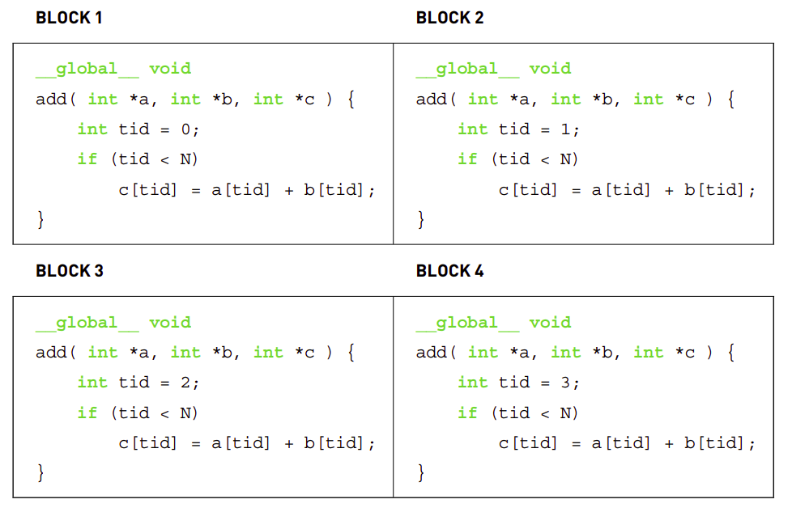

# Parallel Programming in CUDA C

## CPU Vector Sum
Refer to [VectorSumInC.cu](Programs/Chapter4/VectorSumCPU.cu).

This code is written to add vectors a and b to vector c. This is written in standard C code. In the add() function, the sum is computed in a while loop where the index tid ranges from 0 to N-1.

## GPU Vector Sum
Refer to [VectorSumInCUDA.cu](Programs/Chapter4/VectorSumGPU.cu).

In this code, there are the following changes:
1. We allocate three arrays on the device: two arrays, dev_a and dev_b, to hold inputs, and one array, dev_c, to hold the result.
2. *cudaFree()*
3. *cudaMemcpy()*
4. Device code *add()* is called from host code *main()* using the <<< >>> syntax.

In this code, we filled in input arrays in the host code. This operation can be done faster by filling the vectors in the device code.

The *add()* is executed on the device by adding a \_\_global__ qualifier to the function name. In the function call,
> add<<<N,1>>>( dev _ a, dev _ b, dev _ c );

The first number in those parameters represents the number of parallel blocks in which we would like the device to execute our kernel. In this case, we’re passing the value N for this parameter.

For example, if we launch with *kernel<<<2,1>>>()*, you can think of the runtime creating two copies of the kernel and running them in parallel. We call each of these parallel invocations a **block**.  With *kernel<<<256,1>>>()*, you would get 256 blocks running on the GPU. Parallel programming has never been easier.

**Experiment**: Add function was written in CPU and GPU code to do addition of 1000000 numbers and the result shows the GPU based Cuda code is 15000 times faster than CPU based code.

**blockIdx.x**: At first glance, it looks like this variable should cause a syntax error at compile time since we use it to assign the value of tid, but we have never defined it. However, there is no need to define the variable blockIdx; this is one of the built-in variables that the CUDA runtime defines for us. Furthermore, we use this variable for exactly what it sounds like it means. It contains the value of the block index for whichever block is currently running the device code.

Is it not just blockIdx? Why blockIdx.x? As it turns out, CUDA C allows you to define a group of blocks in two dimensions. For problems with two-dimensional domains, such as matrix math or image processing, it is often convenient to use two-dimensional indexing to avoid annoying translations from linear to rectangular indices.

When we launched the kernel, we specified N as the number of parallel blocks. We call the collection of parallel blocks a grid. This specifies to the runtime system that we want a one-dimensional grid of N blocks (scalar values are interpreted as one-dimensional). These threads will have varying values for blockIdx.x, with the first taking value 0 and the last taking value N-1. So, imagine four blocks, all running through the same copy of the device code but having different values for the variable blockIdx.x.

The above image shows the actual code being copied for 4 blocks for execution.

Why do we check whether tid is less than N?
It should always be less than N, since we’ve specifically launched our kernel such that this assumption holds. For safety, we use this condition.

If you would like to see how easy it is to generate a massively parallel application, try changing the 10 in the line #define N 10 to 10000 or 50000 to launch tens of thousands of parallel blocks. Be warned, though: No dimension of your launch of blocks may exceed 65,535. This is simply a hardware-imposed limit, so you will start to see failures if you attempt launches with more blocks than this.

## Julia Set

### CPU Execution

Compute the Julia set for the following equation:
> Z(n+1) = Z(n) * Z(n) + C

Create an image and iterate through all points we care to render, calling *julia()* on each to determine membership in the Julia Set. The function *julia()* will return 1 if the point is in the set and 0 if it is not in the set. We set the point’s colour to be red if *julia()* returns 1 and black if it returns 0. In the *julia()* function, the pixel coordinate is first translated to the centre (DIM/2), and then, to ensure that the image spans the range of -1.0 to 1.0, we scale the image coordinate by DIM/2. Then, to potentially zoom in or out, we introduce a scale factor. Currently, the scale is hard-coded to be 1.5.

After obtaining the point in complex space, we then need to determine whether the point is in or out of the Julia set. In the code, we compute 200 iterations of this function. After each iteration, we check whether the magnitude of the result exceeds some threshold (1,000 for our purposes). If so, the equation is diverging, and we can return 0 to indicate that the point is not in the set. On the other hand, if we finish all 200 iterations and the magnitude is still bounded under 1,000, we assume that the point is in the set, and we return 1 to the caller, *kernel()*.

This logic is implemented for execution on both the CPU and GPU.

Refer to [JuliaSetCPU.cu](Programs/Chapter4/JuliaSetCPU.cu) for the CPU implementation.

### GPU Execution

The flow of this version is similar to the CPU version, with the additional items we have learned till now:
1. Declaring device pointers.
2. Assigning memory to device pointers by using *cudaMalloc()*.
3. Assigning values to the device pointers by using *cudaMemcpy()*.
4. Calling the device function using <<< >>> with the parallel block information mentioned in them.
5. Declaring device functions by using the \_\_global__ qualifier.
6. Copying the returned values back to the host pointer.

The most significant difference is the use of the following code:
> dim3 grid(DIM, DIM);

Because each pixel can be computed independently of every other pixel, we simply specify one copy of the function for each pixel we want to compute. The image domain needs 2D indexing, so there is a need to specify a 2D grid of blocks, as done in the above code.

The type *dim3* is not a standard C type. Rather, the CUDA runtime header files define some convenience types to encapsulate multidimensional tuples. The type *dim3* represents a three-dimensional tuple that will be used to specify the size of our launch.

But why do we use a three-dimensional value when we clearly stated that our launch is a two-dimensional grid?
Frankly, this is done because a three-dimensional, *dim3* value is what the CUDA runtime expects. Although a three-dimensional launch grid is not currently supported, the CUDA runtime still expects a *dim3* variable where the last component equals 1. When we initialise it with only two values, as we do in the above code statement, the CUDA runtime automatically fills the third dimension with the value 1, so everything here will work as expected.

We do not need the *x* and *y* indices as used in *kernel()* for the loop in JuliaSetCPU.cu. These indices are fetched using the *blockIdx* variable.

The next change is the *gridDim.x* used for computing the *offset* value computation in *kenel()*. This variable is a constant across all blocks and simply holds the dimensions of the grid that was launched, i.e. (DIM, DIM).

The remaining function, i.e., julia() and structure i.e. cuComplex remain as they are. The one difference is the qualifier \_\_device__, which indicates that this code will run on a device and not on the host. Recall that because these functions are declared as \_\_device__ functions, they will be callable only from other \_\_device__ functions or from \_\_global__ functions.
