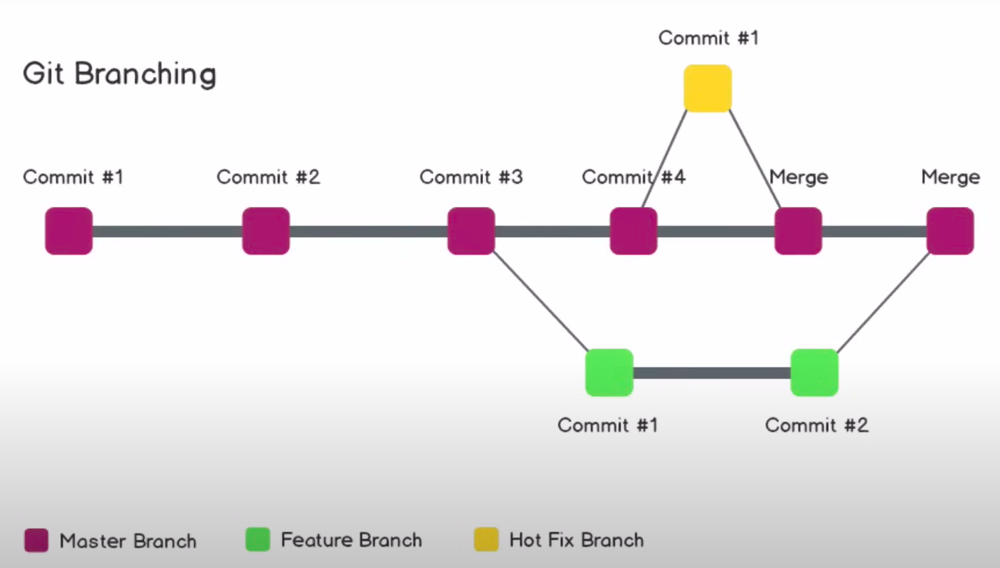

# Git and GitHub for Beginners - Crash Course by freeCodeCamp.org on YouTube

Git is a free and open-source version control system. 

### What is version control?
The management of changes to docs, programs, websites and other information.

### Terms:
1. Directory: folder.
2. Terminal or cmd: Interface.
3. CLI: Command line interface.
4. cd: change directory
5. code editor
6. Repository: Project or folder
7. Pull request(PR): A request to have your code pulled into another branch. For example, a feature branch needs to be pulled into its master branch then a PR is required. Once a feature branch is merged then generally the feature branch is deleted and the developer can create another branch from the master branch for further development.
8. Forking: Make a copy of a repo to work on it. It will be the exact copy of the original which will be controlled by you.

### Git commands:
1. `git clone`: Bring a repo that is hosted somewhere like GitHub to a folder on your local machine.
2. `git add`: Track your files and changes on Git. `git add .` will add all the modified or new files in the current folder to the next commit.
3. `git commit`: Save your files in Git to the local repository.
4. `git push`: Upload Git commits to a remote repo like GitHub. The name of the repo to be used for code pushing needs to be mentioned in this command. Also, a default branch can be selected for push operations by using `git push --set-upstream <branch_name>`.
5. `git pull`: Download the changes from a remote repo to your local machine.
6. `git status`: To check the status of the files and folders in the local machine as modified or new or something else.
7. `git init`: Used to declare a local repo as a git repo.
8. `git remote add`: Used to provide a reference of the remote repo to a local repo.
9. `git remote -v`: Shows all the remote repos connected to the current local repo.
10. `git branch`: View the branch name.
11. `git checkout`: Used to switch between branches in the local machine.
12. `git checkout -b`: Create a new branch.
13. `git diff`: Compares 2 versions of the code.
14. `git merge`: used to merge the code of a branch to another branch.
15. `git branch -d`: Used to delete a branch.
16. `git commit -am`: A single command to add and commit the changes, works only for modified file cases, in case of a new file the file has to be staged with git first.
17. `git reset`: Used to undo the staging of the files in Git.
18. `git reset HEAD`: Unstage the committed changes in the last commit, `~` can be used to point to the revision number of the commit required to be unstaged. Alternatively, hash IDs can also be used to point to the committed version that needs to be changed.
   
### Notes
1. Repository is a project in GitHub.
2. Providing comments for every commit is necessary.
3. The `git commit` command requires a message for the commit anyone is doing.
4. SSH keys: to push the code to the remote repo the git must know that you are the owner of that repo. This authority can be shown by using SSH keys.
5. GitHub PR GUI provides facilities like conversation, commit, checks and viewing of file updates for the PR activity.
6. Merge conflicts: When the master is getting updated from more than 1 branch, this situation can create conflicts when there are changes at a single location from multiple branches. Git does not know which commit to take and which to ignore, this has to be done manually.
7. In a large project there are branches for feature development which are then merged into the `dev` branch and when all the changes in the dev branch are ready then it is merged into to master. Temporary branches are deleted after merging to dev, dev and master are never deleted.

### Workflows
1. GitHub workflow:  
Write code -> Commit changes -> Make a pull request
2. Local git workflow:  
Write code -> Stage changes (git add) -> Commit changes (git commit) -> Push changes (git push) -> Make a pull request

### Git Branching
1. The master branch is the main branch of a repo.
2. Feature branch is the continuously developing branch. The tested features from this branch are merged with the master branch.
3. Hot fix branch: Any bug resolution for the main branch is taken care of in this branch.

source: https://www.youtube.com/watch?v=RGOj5yH7evk&t=399s
